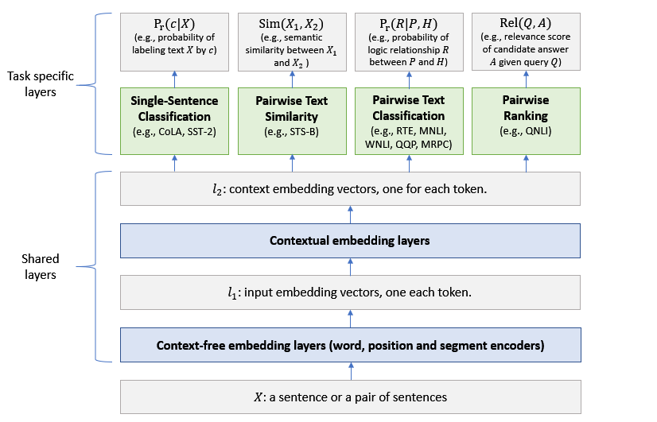

# 自然语言处理算法

1. ### NLP中的巧妙idea

   #### **一、前深度学习时代**：

   - ##### 分布式假设（Distributional Hypothesis）

     "*Linguistic items with similar distributions have similar meanings.*" [参考](https://link.zhihu.com/?target=https%3A//en.wikipedia.org/wiki/Distributional_semantics)

     直白点就是，一个词的语义可以用它的上下文表示。

     对NLP来说，个人觉得分布式假设是来自语言学的最有价值的“理论”之一。

   - ##### 词袋模型（Bag-of-Words）
   
     将一篇文档看作是一个词的集合，不考虑语法，甚至是词序信息也都抛弃了。
   
     BoW模型解决了用机器学习来做NLP的一个痛点问题：怎样把一个变成的文本序列转换为定长的向量。相关扩展：N-gram，TF-IDF等
   
   - ##### 潜在语义分析（Latent Semantic Analysis）
   
     基于上面的分布式假设和词袋模型，我们可以构建一个词-文档矩阵（[term-document matrix](https://link.zhihu.com/?target=https%3A//en.wikipedia.org/wiki/Term-document_matrix)）$X$ 。这个矩阵$X$ 很有意思，每一列为一个文档的表示（BoW向量），每一行为一个词的语义表示（分布式假设，其中上下文是以文档为基本单位）。这样我们就可以用$X^{\rm T}X$ 表示文档和文档之间的关系，用 ![[公式]](https://www.zhihu.com/equation?tex=XX%5E%7BT%7D) 表示词与词之间的关系。这个矩阵还可以进行SVD分解，得到词和文档的稠密向量表示，可以发现潜在的语义信息（比如主题等）。
   
   - ##### 概率主题模型（Probabilistic Topic Models ）
   
     概率主题模型比词袋模型多引入了一个“主题（Topic）”作为隐变量。词和文档的之间关联变成了：文档->主题->词。这个想法合情合理，听上去就更好。如果你觉得哪里不好，又可以魔改。概率主题模型的数学基础（概率有向图模型）十分漂亮，并且基于吉布斯采样的推断简单到不可思议，甚至不需要图模型的知识就可以理解。PTM是前深度学习时代NLP领域的一个大宝矿。
   
   - ##### 基于BMES的中文分词或基于BIO的NER/Chunking
   
     BMES 是Begin/Middle/End/Single的缩写，代表所标记的字符是一个词语的开始/中间/结尾/单字词。
   
     BIO是Begin/Inside/Outside的缩写，表示所标记的词是一个实体名的开始/内部/外部。
   
     这种标记将带有分割性质的NLP任务转换为序列标注任务，可以使用HMM、CRF等成熟的机器学习模型。
   
   - ##### 基于PageRank的TextRank
   
     PageRank本身非常巧妙了，TextRank更是巧妙地将PageRank应用到NLP中的词排序或句子排序上面，比如关键词抽取、文本摘要等。
   
   #### 二、深度学习时代：
   
   + **CRF**，条件随机场是解决序列标注的主流模型，在中文分词、词性标注、实体识别等任务直到现在仍然是标准模型。
   + **word2vec**，包括Skipgram和CBOW，2013年引爆NLP深度学习浪潮的里程碑算法，引领2013-2016年的词表示学习研究热潮。我还特别喜欢基于word2vec，哈工大师生做的那篇ACL 2014用于上下位关系抽取的扩展工作，非常NLP的研究方法，值得推荐。
   + **RNN & LSTM**，神经网络语言模型的代表作，将语言马尔科夫性与神经网络有机融合，影响巨大。
   + **Attention**，神经网络用于自然语言处理不可或缺的重要机制，解决长程依赖的灵丹妙药。
   + **BERT**，简单粗暴有效，2018年引起自然语言处理预训练语言模型浪潮。
   
2. ### NLP常见任务和数据集

   根据判断主题的级别, 将所有的NLP任务分为两种类型:

   - **token-level task**: token级别的任务. 如完形填空(Cloze), 预测句子中某个位置的单词; 或者实体识别; 或是词性标注; SQuAD等. 

   - **sequence-level task:** 序列级别的任务, 也可以理解为句子级别的任务. 如情感分类等各种句子分类问题; 推断两个句子的是否是同义等.

     #### 一、token-level task

     1. **Cloze task**：即BERT模型预训练的两个任务之一, 等价于完形填空任务, 即给出句子中其他的上下午token, 推测出当前位置应当是什么token.解决这个问题就可以直接参考BERT在预训练时使用到的模型: masked language model. 即在与训练时, 将句子中的部分token用[masked]这个特殊的token进行替换, 就是将部分单词遮掩住, 然后目标就是预测[masked]对应位置的单词.这种训练的好处是不需要人工标注的数据. 只需要通过合适的方法, 对现有语料中的句子进行随机的遮掩即可得到可以用来训练的语料. 训练好的模型, 就可以直接使用了.

     2. **SQuAD(Standford Question Answering Dataset) task**:
         这是一个生成式的任务. 样本为语句对. 给出一个问题, 和一段来自于Wikipedia的文本, 其中这段文本之中, 包含这个问题的答案, 返回一短语句作为答案.因为给出答案, 这是一个生成式的问题, 这个问题的特殊性在于最终的答案包含在语句对的文本内容之中, 是有范围的, 而且是连续分布在内容之中的.因此, 我们找出答案在文本语句的开始和结尾处, 就能找到最后的答案. 通过对文本语句序列中每个token对应的所有hidden vector做softmax判断是开始的概率和是结束的概率, 最大化这个概率就能进行训练, 并得到输出的结果.
     
       3. **Named Entity Recognition**
          本质是对句子中的每个token打标签, 判断每个token的类别.
     
          常用的**数据集**有:NER(Named Entity Recognition) dataset: 对应于Person, Organization, Location, Miscellaneous, or Other (non-named entity).
  
     #### 	二、 sequence-level task
  
     1. **NLI(Natural Language Inference) task**
  
        自然语言推断任务, 即给出一对(a pair of)句子, 判断两个句子是entailment(相近), contradiction(矛盾)还是neutral(中立)的. 由于也是分类问题, 也被称为sentence pair classification tasks.在智能问答, 智能客服, 多轮对话中有应用.
  
        常用的数据集有:
  
        ​		**MNLI(Multi-Genre Natural Language Inference):** 是GLUE Datasets(General Language 	Understanding Evaluation)中的一个数据集. 是一个大规模的来源众多的数据集, 目的就是推断两个句子是意思相近, 矛盾, 还是无关的.
        ​		**WNLI(Winograd NLI)**
  
     2. **Sentence Pair Classification tasks**
  
        两个句子相关性的分类问题, NLI task是其中的特殊情况. 经典的此类问题和对应的数据集有:
  
        **QQP(Quora Question Pairs):** 这是一个二分类数据集. 目的是判断两个来自于Quora的问题句子在语义上是否是等价的.
           **QNLI(Question Natural Language Inference):** 也是一个二分类问题, 两个句子是一个(question, answer)对. 正样本为answer是对应question的答案, 负样本则相反.
        **STS-B(Semantic Textual Similarity Benchmark):** 这是一个类似回归的问题. 给出一对句子, 使用1~5的评分评价两者在语义上的相似程度.
           **MRPC(Microsoft Research Paraphrase Corpus):** 句子对来源于对同一条新闻的评论. 判断这一对句子在语义上是否相同.
        **RTE(Recognizing Textual Entailment):** 是一个二分类问题, 类似于MNLI, 但是数据量少很多.
  
     3. **Single Sentence Classification tasks**
        **SST-2(Stanford Sentiment Treebank):** 单句的二分类问题, 句子的来源于人们对一部电影的评价, 判断这个句子的情感.
        **CoLA(Corpus of Linguistic Acceptability):** 单句的二分类问题, 判断一个英文句子在语法上是不是可接受的.
  
     4. **SWAG(Situations With Adversarial Generations)**
        给出一个陈述句子和4个备选句子, 判断前者与后者中的哪一个最有逻辑的连续性, 相当于阅读理解问题.

3. ### n-gram模型

   [N-gram 语言模型](https://sunoonlee.github.io/2017/03/ngram/)

   **二、N-Gram模型详解**

   既然要做语言模型，基于统计概率来说，我们需要计算句子的概率大小：

   

    ，这个也就是最终要求的一句话的概率了，概率大，说明更合理，概率小，说明不合理，不是人话。。。。

   因为是不能直接计算，所以我们先应用条件概率得到

   

   中间插入下条件概率： P(B|A)：A 条件下 B 发生的概率。从一个大的空间进入到一个子空间（切片），计算在子空间中的占比。

   

   然而，如果直接算条件概率转化后的式子的话，对每个词要考虑它前面的所有词，这在实际中意义不大，显然并不好算。那这个时候我们可以添加什么假设来简化吗？可以的，我们可以基于马尔科夫假设来做简化。

   **什么是马尔科夫假设？**

   马尔科夫假设是指，每个词出现的概率只跟它前面的少数几个词有关。比如，二阶马尔科夫假设只考虑前面两个词，相应的语言模型是三元模型。引入了马尔科夫假设的语言模型，也可以叫做马尔科夫模型。

   马尔可夫链（Markov chain）为状态空间中经过从一个状态到另一个状态的转换的随机过程。该过程要求具备“无记忆”的性质：下一状态的概率分布只能由当前状态决定，在时间序列中它前面的事件均与之无关。

   也就是说，应用了这个假设表明了当前这个词仅仅跟前面几个有限的词相关，因此也就不必追溯到最开始的那个词，这样便可以大幅缩减上述算式的长度。即式子变成了这样：

   

   > 注：这里的m表示前m个词相关

   然后，我们就可以设置m=1，2，3，....得到相应的一元模型，二元模型，三元模型了，关于

   当 m=1, 一个一元模型（unigram model)即为 ：

   

   当 m=2, 一个二元模型（bigram model)即为 ：

   

   当 m=3, 一个三元模型（trigram model)即为

   

   而N-Gram模型也就是这样，当m=1，叫1-gram或者unigram ；m=2，叫2-gram或者bigram ；当 m=3叫3-gram或者trigram ；当m=N时，就表示的是N-gram啦。

4. ### 神经网络语言模型

   

5. ### 词向量

   **word2vec**  《Efficient Estimation of Word Representation in Vector Space》

   github开源地址：

   1. gensim(Topic Modelling in Python) :    https://github.com/RaRe-Technologies/gensim/
   2. Python interface to Google word2vec: https://github.com/danielfrg/word2vec

   

   

   

   **golve **  《Glove: Global vectors for word representation》

   word2vec只考虑到了词的局部信息，没有考虑到词与局部窗口外词的联系，glove利用共现矩阵，同时考虑了局部信息和整体的信息。

   

   **ELMO**  《Deep contextualized word representations》

   github地址：https://github.com/allenai/allennlp/blob/master/tutorials/how_to/elmo.md

   word2vec和glove由于用固定词向量表示词，因此无法解决一词多意现象。Elmo针对不同语境(上下文)，给出词的不同向量表示。

   

   **bert**  《Bidirectional Encoder Representation from Transformers》

   github地址:   https://github.com/google-research/bert

6. ### seq2seq

   基本的 Encoder-Decoder模型 ,编码器和解码器都是RNN模型，

   一种是解码器将原始句子编码为固定向量$c$，然后将$c$作为初始状态提供给加码器，如下图。

   

   另一种是将编码器输出的状态向量$c$当做加码器RNN每一步的输入。

   由于

   这种Encoder-Decoder结构不限制输入和输出的序列长度，因此应用的范围非常广泛，比如：

   **机器翻译。**Encoder-Decoder的最经典应用，事实上这一结构就是在机器翻译领域最先提出的

   **文本摘要**。输入是一段文本序列，输出是这段文本序列的摘要序列。

   **阅读理解。**将输入的文章和问题分别编码，再对其进行解码得到问题的答案。

   **语音识别。**输入是语音信号序列，输出是文字序列。

   

7. ### 注意力机制

   ​      

8. ### transformer模型

      《all atttention is you need》

      github地址: https://github.com/harvardnlp/annotated-transformer

      https://github.com/Kyubyong/transformer

      苏剑林 github: https://github.com/bojone/attention

      官方实现： https://github.com/tensorflow/tensor2tensor

      预训练语言模型发展概况总结

      

      transformer-XL 《[Transformer-XL：Attentive Language Models Beyond a Fixed-Length Context](https://arxiv.org/pdf/1901.02860.pdf)》

      github地址：https://github.com/kimiyoung/transformer-xl

9. ### GPT模型

      文章《Improving Language Understanding by Generative Pre-Training》

      github地址: https://github.com/openai/finetune-transformer-lm

      

      OpenAI提出的Generative Pre-Training，采用transformer作为基本特征提取单元(仅使用解码器部分)，pre-training+Fine-Tuning的训练模式。单向二阶段训练模型。

      单向语言模型(句子中词只能看到他前面的词)，将transformer编码器模块的多头自注意力木块改成Masked-self attention。

      

      

      1. 预训练阶段，采用无监督数据，用前面的词预测后面的词，最后一位的输出不用。

      2. 精调阶段，采用监督数据，用最后一位的输出做分类。为了避免过拟合，除了用最后一位进行预测，前面的词还和预训练阶段一样，预测下一个词。所以损失函数由两部分组成:
         $$
         \begin{align}
         L_1(\cal C) &= \sum_i \log P(u_i|u_{i-k},\cdots,u_{i-1};\Theta)\\
         L_2(\cal C) &= \sum_{(x,y)}\log P(y|x^1,x^2,\cdots,x^m) \\ 
         L_3(\cal C) &= L_1(\cal C) + \lambda L_2(\cal C)  \\
         \end{align}
         $$
         针对不同任务，输入做不同改造：

         

10. ### bert模型(**B**idirectional **E**ncoder **R**epresentations from **T**ransformers)

          文章:BERT: Pre-training of Deep Bidirectional Transformers for Language Understanding
    
          文章地址：https://arxiv.org/abs/1810.04805
    
          github地址：https://github.com/google-research/bert

11. ### MT-DNN

             微软多任务深度神经网络，对bert 进行多任务训练。MT-DNN扩展了微软在2015年提出的**多任务DNN模型(Multi-Task DNN)**，引入了谷歌AI开发的预训练双向transformer语言模型BERT。
           
            《Multi-Task Deep Neural Networks for Natural Language Understanding》
           
            github地址：https://github.com/namisan/mt-dnn
           
            

12. ### **GPT 2.0** 

             《Language Models are Unsupervised Multitask Learners》
           
             github地址：https://github.com/openai/gpt-2

13. ### MASS

             《MASS: Masked Sequence to Sequence Pre-training for Language Generation》
           
             github地址： https://github.com/microsoft/MASS
           
             

14. ### UniLM

             《Unified Language Model Pre-training for Natural Language Understanding and Generation》
           
             

       ​      

15. ### XLNet:

             《XLNet: Generalized Autoregressive Pretraining for Language Understanding》
           
             github地址:https://github.com/zihangdai/xlnet
           
             githuba中文预训练模型:https://github.com/ymcui/Chinese-PreTrained-XLNet
           
             提出了自回归语言模型(**Autoregressive LM**)和自编码语言模型概念(**Autoencoder LM**)

             1. **自回归语言模型:**：根据上文内容预测下一个可能跟随的单词，就是常说的自左向右的语言模型任务，或者反过来也行，就是根据下文预测前面的单词，这种类型的LM被称为自回归语言模型。
           
             2. **自编码语言模型**：bert通过mask掉部分词，实现通过上下文来预测masked掉的词，实现双向语言模型，这个其实就类似在训练数据中加入噪声，是一种Denoising Autoencoder的思路，因此把这种模型称为Autoencoder LM 。由于在输入数据中引入噪声，导致预训练阶段和精调阶段使用模式不一致。
           
                XLNet的出发点就是：能否融合自回归LM和DAE LM两者的优点。提出Permutation Language Model。
           
                bert模型中，在计算被masked掉单词自注意力时，统一采用‘mask’这个token的词向量作为$x$值，来计算其查询向量$q$。在XLNet中引入双流注意力，内容流和标准transformer一样，在查询流中由于没有采用mask标记，在计算单词的attention时，只采用单词的位置嵌入作为$x$的输入。
           
                对每个序列，不会对每个位置都进行预测，这样容易导致优化困难，训练难以收敛，而是选择扰动后最后几个词进行预测。超参数$k$控制预测的词的数量，等于句子总长度除以需要预测的个数，最佳 K 值介于 6 和 7 （更好）之间。取倒数大约就是bert中的masked掉的词的比例15%。

16. ### ROBERTA

          《RoBERTa: A Robustly Optimized BERT Pretraining Approach》
    
          文章链接 https://arxiv.org/abs/1907.11692
    
          github链接https://github.com/pytorch/fairseq/tree/master/examples/roberta
    
          原始BERT在预训练时使用NSP，作用一直受到质疑。
    
          - 训练更久，batch更大，数据更多
          - 丢弃NSP
          - 在更长的序列上训练
          - 动态改变mask策略

17. ### ALBERT(A LITE BERT)

          《ALBERT: A Lite BERT for Self-supervised Learning of Language Representations》
    
          文章：https://arxiv.org/abs/1909.11942
    
          github 非官方中文与训练模型：https://github.com/brightmart/albert_zh
    
          **ALBERT 的三大改造**：
    
          1. **嵌入向量参数化的因式分解**
          2. **跨层参数共享**
          3. **句子语序预测SOP**

18. ### T5(Text-to-Text Transfer Transformer)

             **《Exploring the Limits of Transfer Learning with a Unified Text-to-Text Transformer》**
           
             论文链接：https://arxiv.org/abs/1910.10683Github 
           
             github地址：https://github.com/google-research/text-to-text-transfer-transforme
           
             构建更大的C4语料库(750GB)

19. ### BART模型

             [BART: Denoising Sequence-to-Sequence Pre-training for Natural Language Generation, Translation, and Comprehension](https://arxiv.org/pdf/1910.13461.pdf)
           
             https://arxiv.org/abs/1910.13461
    
          github地址:
    
             在文本摘要上取得令人惊叹的效果。

20. ### ICLR 2020 

             **Encoder-Agnostic Adaptation for Conditional Language Generation**
           
             https://openreview.net/pdf?id=B1xq264YvH
           
             对于非生成类任务，大型预训练模型已经成为刷SOTA的标配，但是怎么把预训练用到语言生成上去。本文提出了三种encoder-agnostic的方法，将任一encoder得到的特征表示送入decoder并生成相应任务的句子。这里的encoder是具体任务相关的、随机初始化的。
           
             而这三种方法的区别在于，decoder的不同部分有不同的初始化，但总的来说都分为使用预训练模型初始化或随机初始化。整个模型使用监督方法训练。在多个生成任务上的实验表明，这种方法的确可以显著提高生成效果。
           
             **推荐理由：**方法简单、有效、通用。

21. ### ELECTRA(ICLR  2020) 

                **ELECTRA: Pre-training Text Encoders as Discriminators Rather Than Generators**
           
             https://openreview.net/pdf?id=r1xMH1BtvB   
           
             ELECTRA最主要的贡献是提出了新的预训练任务和框架，把生成式的Masked language model(MLM)预训练任务改成了判别式的Replaced token detection(RTD)任务，判断当前token是否被语言模型替换过。

22. 

       ​      

