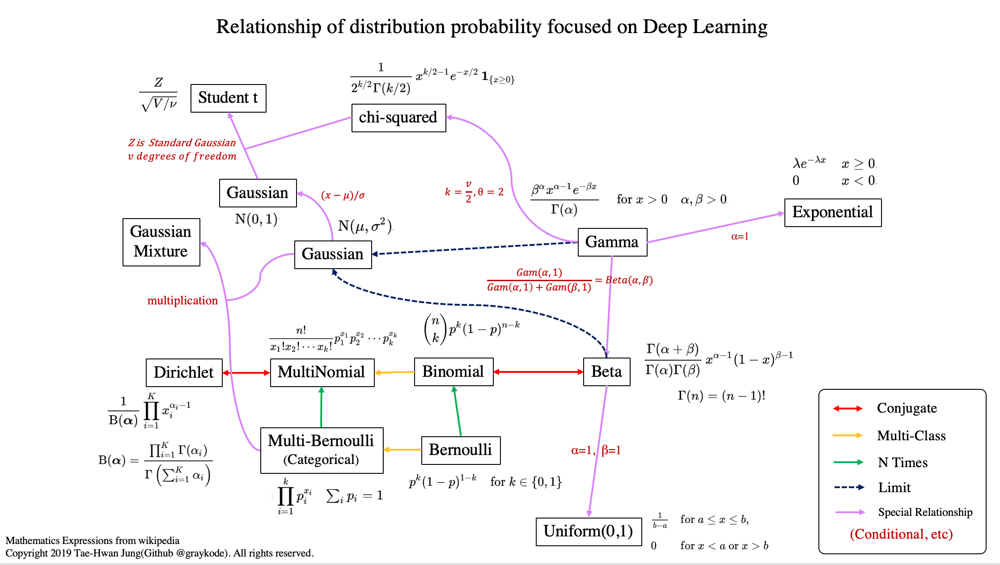
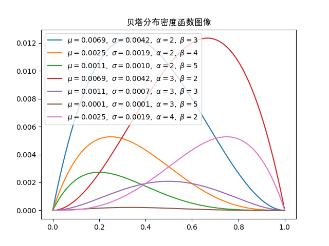
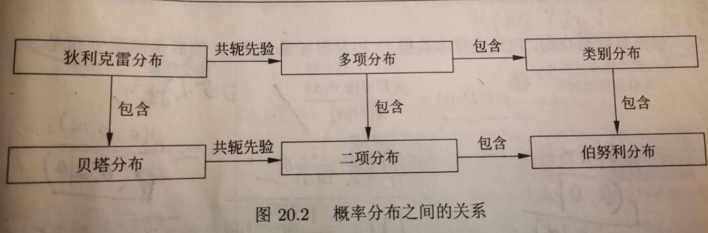
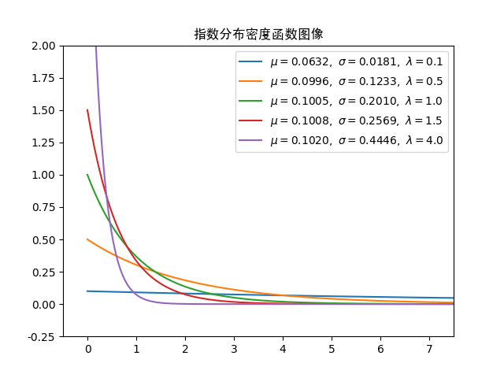
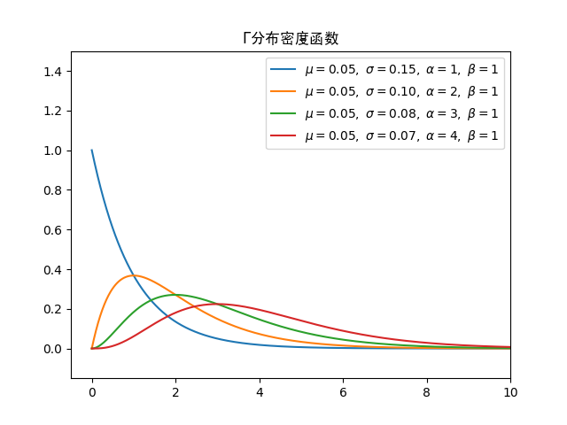
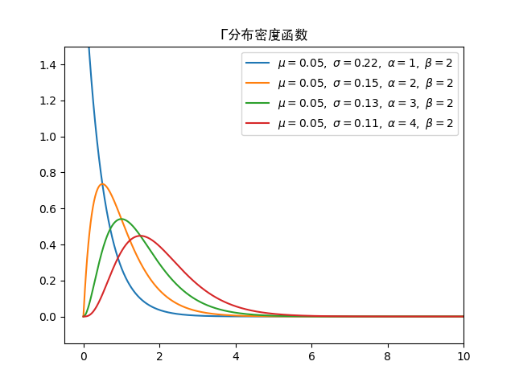
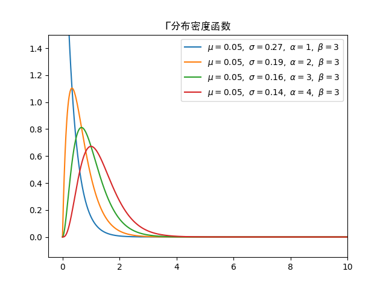
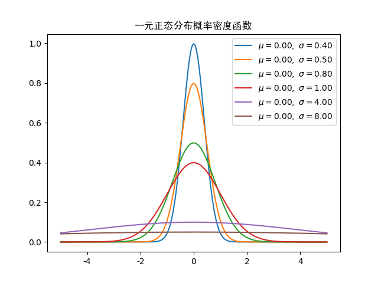
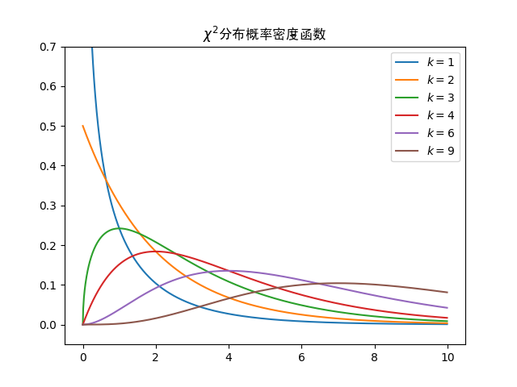
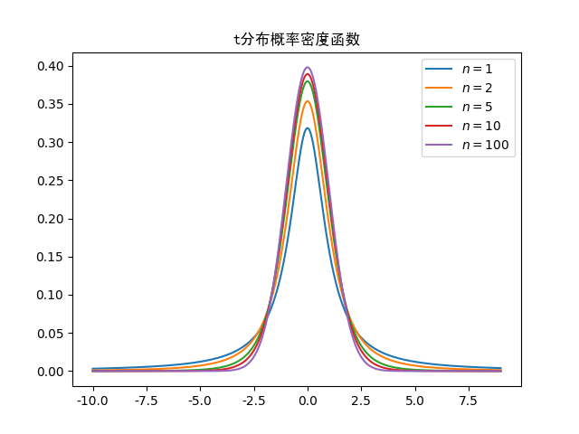

# 机器学习中常见概率分布

1. ### 均匀分布

   均匀分布是最简单的一类分布。

   连续均匀分布是指在取值区间$[a,b]$上，概率密度函数取值都相同：
   $$
   p(x)= \left\{\begin{align}
   &\frac{1}{b-a} & a\le x\le b\\\\
   &0&否则
   \end{align}\right.
   $$

   离散均匀分布是在每个可能的取值上具有相同的概率。

2. ### 伯努利分布

   伯努利分布(Bernoulli distribution)又称**两点分布**或**0-1分布**。**伯努利试验**是只有两种可能结果的**单次随机试验**。比如抛硬币问题，刚出生的婴儿是男孩女孩问题等。用随机变量$X$表示伯努利试验结果，一般用0，1表示试验中两种结果状态，则$X$服从伯努利分布。假设$p$为试验结果成功($X=1$)的概率，则伯努利分布的概率密度为:
   $$
   \begin{array}&p(x|p)&=&\left\{\begin{align}
   &p& x=1\\\\
   &1-p& x=0
   \end{align}\right.\\\\
   &=&p^x(1-p)^{(1-x)}
   \end{array}
   $$

3. ### 二项分布

   二项分布描述的是$n$次独立的伯努利试验中成功次数的离散概率分布。参数为$(n,p)$的二项分布，其分布函数为:
   $$
   p(K=k)=\dbinom{n}{k}p^k(1-p)^{(n-k)}
   $$
   从以上定义可以看出，伯努利分布是二项分布$n=1$的一种特殊情形。二项分布的一个典型例子是扔$n$次硬币出现正面的次数。

   二项分布名称的由来，是由于其概率质量函数中使用了二项系数，该系数是二项式定理中的系数。

4. ### 类别(catergory)分布

   类别分布是伯努利分布的一种推广。在一次随机实试验中可能出现K个不同结果，假设出现不同结果的概率分别为$p=(p_1,p_2,\cdots,p_K)$，其中$\sum_{i=1}^K p_i = 1$。类别分布概率分布为:
   $$
   p(x|p)=p_i(x=i,i=1,2,\cdots,K)=\Pi_{i=1}^Kp_i^{\mathrm I_{x=i}}
   $$
   其中$\mathrm I_{x=i}$为示性函数。

   类别分布的典型例子是掷骰子试验中出现各个点数的概率。

   多类分类中，每个样本属于不同类的概率也是类别分布。这也是类别分布的由来。

5. ### 多项分布

    多项分布是类别分布在多次试验下的推广，同时也是二项分布在多类别下的推广。

    多项分布描述的是独立进行$n$次能出现多个结果的随机试验中，出现各个类别的次数的概率分布。假设随机试验可能出现$K$个结果，每个结果结果出现的概率为$p=(p_1,p_2,\cdots,p_K)$，其中$\sum_{i=1}^K p_i = 1$。则进行$n$次独立试验后，每个结果出现次数记为$X=(x_1,x_2,\cdots,x_K)$，则:
    $$
    p(x=(n_1,n_2,\cdots,n_K)|p,n) = \left\{\begin{align}\frac{n!}{n_1!n_2!\cdots n_K!}p_1^{n_1}p_2^{n_2}\cdots p_K^{n_K}&，& \sum_{i=1}^K n_i = n\\\\
    0&，& 否则\end{align}\right.
    $$

> 在叙述下面几个分布时，先来看看$\Gamma$函数。$\Gamma$函数定义如下：
> $$
> \Gamma(x) = \int _0^\infty t^{(x-1)}e^{-t}dt
> $$
> 利用分步积分，可以得到$\Gamma$函数的如下性质:
> $$
> \Gamma(x+1) = x\Gamma(x)
> $$
> 分步积分公式:
> $$
> \int u(x)v'(x)dx  = u(x)v(x) - \int u'(x)v(x)dx
> $$
> 定积分类似。
>
> 所以: 
> $$
> \Gamma (x+1) =\int _0^\infty t^{x}e^{-t}dt = -t^xe^{-t}|_0^\infty - \int_0^\infty x t^{(x-1)}(-e^{-t})dt = x\int_0^\infty t^{(x-1)}e^{-t}dt = x\Gamma (x)
> $$
>
> 因此，$\Gamma$函数可以看成是阶乘在实数集上的延拓，且
> $$
> \Gamma(n) = (n-1)！
> $$
> 对$x \in (0,1)$，有
> $$
> \Gamma(1-x)\Gamma(x) = \frac{\pi}{\sin \pi x}
> $$
>  此公式称为**余元公式**。所以$\Gamma(\frac{1}{2}) = \sqrt\pi$ 
>
> $\Gamma(1) = 1$

6. ###  $\Beta$(贝塔)分布

     $\Beta$分布是指具具有如下形式的概率分布,$X$是取值为$(0,1)$的连续随机变量，其概率密度函数为:
     $$
     p(x,\alpha,\beta) = \frac{1}{\Beta(\alpha,\beta)}x^{\alpha-1}(1-x)^{\beta-1}dx
     $$
     其中$\alpha>0,\beta>0$为参数，$\Beta(\alpha,\beta) = \int_0^1 x^{\alpha-1}(1-x)^{\beta-1}dx = \frac{\Gamma(\alpha)\Gamma(\beta)}{\Gamma(\alpha+\beta)}$为归一化系数。

     可以看到，$\Beta$分布函数形式上和二项分布很像。

     $\Beta$分布的密度函数图像如下：

     

7. ### Dirichlet(狄利克雷)分布

    若多元随机变量的$x=(x_1,x_2,\cdots,x_k)$的概率密度函数为如下形式:
    $$
    p(x|\alpha) = \frac{\Gamma(\sum\limits_{i=1}^k \alpha_i)}{\prod\limits_i^k\Gamma(\alpha_i)}\prod\limits_{i=1}^kx_i^{\alpha_i-1}
    $$
    其中$\sum\limits_{i=1}^k x_i =1,\alpha_i\ge0,\alpha=(\alpha_1,\alpha_2,\cdots,\alpha_k)$,则称$x$服从参数为$\alpha$的狄利克雷分布，记为$x\sim Dir(\alpha)$。

    可以看到Dirichlet分布函数形式和多项分布很像。

    狄利克雷的概率密度函数图像如下：

    > **贝叶斯学派和频率学派**：**频率学派**认为带估计的参数是一个未知的固定值。而**贝叶斯学派**则认为待估计的参数是一个随机变量，服从一定的分布。因此其特别重视参数的先验知识(先验概率)对推理inference的影响。
    >
    > 假设待估计的参数为$\theta$,贝叶斯学派认为$\theta$为随机变量，服从一定的分布$p(\theta)$,这个$p(\theta)$就是先验概率
    >
    > 在得到观测数据$x$后，对$\theta$的分布进行修正，得到$\theta$的分布，成为后验概率分布:
    >
    > $p(\theta|x) = \frac{p(x,\theta)}{p(x)} = \frac{p(x|\theta)p(\theta)}{p(x)}$
    >
    > 若先验分布$p(\theta)$和后验分布$p(\theta|x)$满足同样的分布律(分布相同，只是参数不同)，则先验分布和后验分布被叫做**共轭分布**。同时，先验分布叫做似然函数的共轭先验分布。这句话可以这么理解，假设数据服从某个分布(称为A)，其待估计参数为$\theta$， 其先验分布为B，通过其先验分布和似然函数(上式)得到的后验分布分布认识B(参数不同)，所以$\theta$的先验分布和后验分布为共轭分布，分布B又叫做分布A的**共轭先验分布**。
    >
    > 共轭分布总是针对分布中的某个参数θ而言。机器学习中之所以采用共轭先验的原因是可以使得先验分布和后验分布的形式相同，只是参数不同。这样一方面合符人的直观（它们应该是相同形式的）另外一方面是可以形成一个先验链，即现在的后验分布可以作为下一次计算的先验分布，如果形式相同，就可以形成一个链条。

    综上，通过分析可得，**二项分布的共轭先验分布是$\Beta$分布，多项分布的共轭先验分布是狄利克雷分布。**

    

8. ### 指数分布

    指数分布（也称为负指数分布）是描述泊松过程中的事件之间的时间的概率分布，即事件以恒定平均速率连续且独立地发生的过程。它是**几何分布**的连续模拟，它具有无记忆的关键性质。指数函数的一个重要特征是无记忆性（Memoryless Property，又称遗失记忆性）。这表示如果一个随机变量呈指数分布，当$s,t>0$时有$p(T>t+s|T>t)=P(T>s)$。一个例子是：如果T是某一元件的寿命，已知元件使用了t小时，它总共使用至少s+t小时的条件概率，与从开始使用时算起它使用至少s小时的概率相等。

    指数分布的概率密度函数具有如下形式：
    $$
    p(x|\lambda) = \left\{ \begin{align}\lambda e^{-\lambda x}&,& x>0\\\\0&,&x\le 0\end{align}\right.
    $$
    他一般描述过程中等到一件事情发生所用的时间的概率分布。

    指数分布的均值和方差如下：
    $$
    均值: \mu = \frac{1}{\lambda}\\\\
    方差: \sigma^2 = \frac{1}{\lambda^2}
    $$

    指数分布的概率密度函数图像如下：

    

    > **几何分布(Geometric distribution)**：是离散型概率分布。其中一种定义为：在重复多次伯努利试验中，试验$k$次才得到第一次成功的机率。详细地说，是：前k-1次皆失败，第k次成功的概率。
    >
    > 因此几何分布的概率函数为:
    > $$
    > p(x|p) = (1-p)^{k-1}p
    > $$
    > 其中参数$p$为一次伯努利试验中成功的概率。

9. ### $\Gamma$(伽马)分布

     伽玛分布解决的问题是“要等到$\alpha$个随机事件都发生，需要经历多久时间”。所以，伽玛分布可以看作是$\alpha$个指数分布的独立随机变量的加总。$\Gamma$分布的密度函数为:
     $$
     p(x,\beta,\alpha) = \frac{\beta^\alpha}{\Gamma (\alpha)}x^{\alpha-1}e^{-\beta x}​
     $$
     其期望和方差为:
     $$
     期望: \mu = \frac{\alpha}{\beta} \\\\
     方差: \sigma^2 = \frac{\alpha}{\beta^2}
     $$

     $\Gamma$分布的密度函数图像如下：

     

     

     

10. ### 正态分布

     正态分布（Normal distribution），也称“常态分布”，又名高斯分布（Gaussian distribution）。多元($n$)正态分布的密度函数为:
     $$
     p(x|\mu,\Sigma) = \frac{1}{(2\pi)^{n/2}|\Sigma|^{1/2}}\exp\left(-\frac{1}{2}(x-\mu)^\mathrm T\Sigma^{-1}(x-\mu)\right)
     $$
     其中参数$\mu,\Sigma$分别表示期望和方差矩阵。上述标准正态分布又记为$\cal N(\mu,\Sigma)$。当$\mu=0,\Sigma=\mathrm I$时，又称为标准正态分布。

     一元正态分布概率密度函数为:
     $$
     p(x|\mu,\sigma^2) =\frac{1}{\sqrt{2\pi}\sigma}\exp\left(-\frac{(x-\mu)^2}{2\sigma^2}\right)
     $$
     一元正态分布的密度函数图像如下：

     

11. ### 卡方分布

      若$k$个相互独立的随机变量$x_1,x_2,\cdots,x_k$均服从标准正态分布，则这$k$个服从标准正态分布的随机变量的平方和构成的新随机变量，服从卡方分布(chi-square distribution)($\chi^2$分布)，记为$\chi^2(k)$，其中参数$k$为随机变量的个数，代表自由度。卡方分布多用在统计学中的方差估计和假设性检验.

        $\chi^2(k)$分布的密度函数具有如下形式:
      $$
      p(x|k) = \frac{1}{2^{k/2}\Gamma(\frac{k}{2})}x^{\frac{k}{2}-1}e^{-\frac{x}{2}}
      $$
      卡方分布密度函数如下：

      

12. ### $t$(学生)分布

**t\-分布**（*t*-distribution）用于根据小样本来估计呈正态分布且方差未知的总体的均值。如果总体方差已知（例如在样本数量足够多时），则应该用正态分布来估计总体均值。$t$分布与样本大小$n$相关，确切地是与自由度$df=n-1$相关。$t$分布与正态分布相似，是对称的，但是其比正态分布宽，当样本数量增加，$t$分布会接近正态分布。

假设$X$服从标准正态分布$\cal N(0,1)$，$Y$服从$\chi^2(n)$分布，则$Z=\frac{X}{\sqrt{Y/n}}$服从自由度为$n$的$t$分布，记为$Z\sim t(n)$。其分布密度函数为:
$$
p(x|n) = \frac{\Gamma(\frac{n+1}{2})}{\sqrt{n\pi}\Gamma(\frac{n}{2})}\left(1+\frac{x^2}{n}\right)^{-\frac{n+1}{2}}
$$
学生分布密度函数图像如下:

